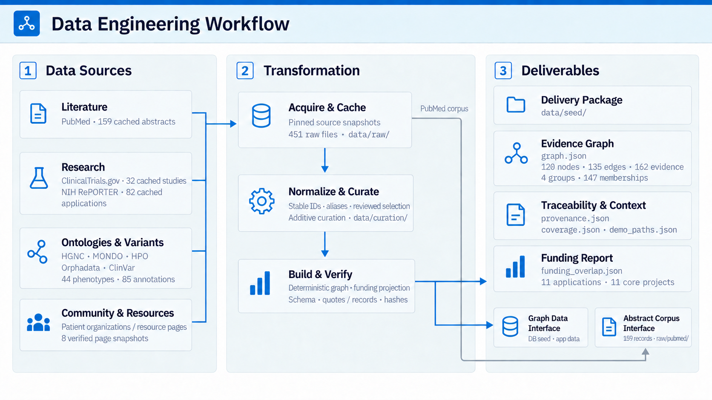
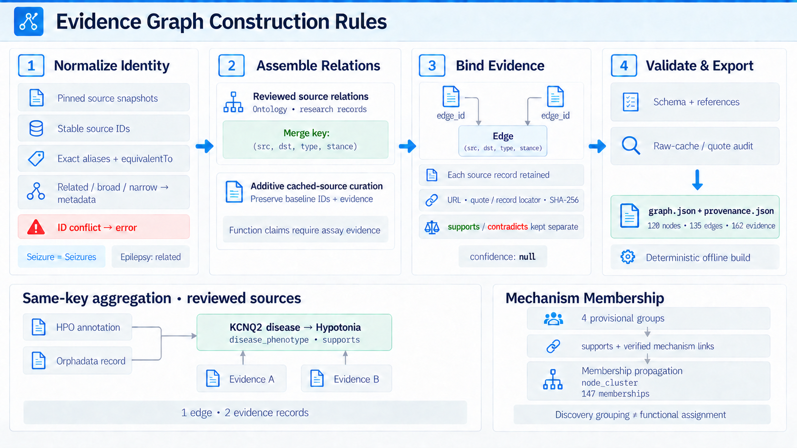

# PathNet: AI Atlas for the World's Rare Diseases

Hack-Nation × OpenAI × Buffalo Initiative, Challenge 05. PathNet helps patients, patient-group leaders and researchers explore cited connections between rare conditions, biological mechanisms, studies, investigators and community resources. The current atlas covers STXBP1, SCN2A, KCNQ2 and SCN8A.

The application uses **Next.js 16, React 19, TypeScript and Cytoscape**, with a reproducible Python data pipeline and PostgreSQL/PostgREST integration. The committed seed contains **120 nodes, 139 edges and 169 evidence records**. Its source-curated data v2 layer and subsequent inferred bridges are described below.

## Explore the atlas

- Search conditions, genes, symptoms, mechanisms and resources by name, synonym or supported identifier.
- Open cited condition and node pages, explore the interactive map or table, and inspect source records, contradictions and the scope of each connection.
- Follow route explanations and create an action plan with tasks, notes and progress saved in the browser.
- Browse mechanism groups, investigators and NIH-linked funding through role-specific views.
- Use the source-bounded atlas assistant in the patient-group-leader and researcher views. Its current answers are deterministic graph queries.
- Configure native accounts for onboarding and saved reading/workspace preferences. Assigned administrators also have local review and synonym demonstrations.

The five perspectives are `family`, `group_leader`, `scout`, `researcher` and `admin`. Viewing preferences control presentation; protected access follows the authenticated account's database role.

## Quick start

### Run the frontend with the current seed

Install Node.js 22 and npm. From the repository root, use Bash:

```bash
cd web
npm ci
NEXT_PUBLIC_DATA_SOURCE=static npm run dev
```

On Windows PowerShell:

```powershell
Set-Location web
npm ci
$env:NEXT_PUBLIC_DATA_SOURCE = "static"
npm run dev
```

Open **http://localhost:5173**. The `predev` step copies the repository seed to `web/public/graph.json`. This mode supports graph exploration without a database; account registration requires the account configuration below. Check existing `web/.env.local` settings when switching data modes.

| Data mode | Source |
| --- | --- |
| `mock` (default) | Pinned frontend example in `web/src/data/slice/`, based on the reviewed data v2 layer |
| `static` | Current seed copied to `web/public/graph.json` during development/build |
| `rest` | Five graph resources from PostgREST, or the session-aware account graph proxy |

Set `NEXT_PUBLIC_DATA_SOURCE` explicitly to select a mode. `NEXT_PUBLIC_API_URL` supplies the REST origin. The frontend can derive additional cited hypotheses in memory, so view-level link counts can exceed the stored seed counts.

### Run the database, REST API and frontend

Install Docker Desktop with Docker Compose v2 and use a Bash terminal from the repository root:

```bash
bash run.sh up
```

Keep that terminal open. Once the services are ready, run this in a second Bash terminal:

```bash
bash run.sh smoke
```

Smoke checks require `curl`, `awk` and `tr`, available in typical Bash environments. Host Python, Node.js and model/cloud credentials are unnecessary for this container startup; the first run downloads container images and locked frontend dependencies.

| Service | Local address |
| --- | --- |
| Next.js frontend | http://localhost:5173 |
| PostgREST API | http://localhost:3001 |
| PostgreSQL database `pathnet` | localhost:54322 |

The startup builds deterministic explanation/coverage caches, applies numbered migrations, upserts the graph and imports the caches before starting the API and frontend. The Compose frontend selects REST data through the supported legacy environment aliases. Account tables are included in the migrations; the frontend account connection is configured separately.

- `bash run.sh seed` upserts the seed and imports the cache bundle while preserving platform records and approved graph contributions.
- `bash run.sh down` stops the services and retains volumes.
- `bash run.sh logs` follows service logs.
- `bash run.sh reset` deletes local database/cache volumes and starts again.

For a parallel stack, set `COMPOSE_PROJECT_NAME`, `PATHNET_DB_PORT`, `PATHNET_API_PORT` and `PATHNET_WEB_PORT` before startup and smoke checks. Defaults are `pathnet`, `54322`, `3001` and `5173`. Historical bootstrap checks are recorded in [the bootstrap notes](context/P4-BOOTSTRAP.md).

## Accounts and saved preferences

Native accounts use the existing PostgreSQL database. Configure `web/.env.local` from [web/.env.example](web/.env.example), replacing its sample database and API addresses with your installation's addresses:

- `PATHNET_ACCOUNT_DATABASE_URL`: server-only PostgreSQL connection.
- `NEXT_PUBLIC_DATA_SOURCE=rest`: database-backed graph mode.
- `NEXT_PUBLIC_ACCOUNT_PROXY=true`: same-origin graph reads using the verified session and PostgreSQL row-level security.

For the host-run account frontend, use Node.js 22/npm and a fresh terminal so earlier data-mode overrides do not replace the settings in `web/.env.local`. If the Compose stack is running, first free the frontend port while keeping its database and API running:

```bash
docker compose stop web
```

Then run from the repository root:

```bash
npm --prefix web run accounts:setup
npm --prefix web run dev
```

Account setup is idempotent and preserves existing users. New registrations receive the `family` database role. An operator can assign a registered user's protected role:

```bash
npm --prefix web run accounts:role -- registered-user@example.com researcher
```

Profiles and workspace preferences are stored in PostgreSQL. Action progress, custom notes and administrator review/synonym demonstrations remain account-scoped browser storage; chat is session-only. The native adapter currently has no email-verification or password-recovery service. Supabase Auth is a separate integration.

See [Accounts, onboarding and reading preferences](docs/frontend/accounts.md) for guest access, administrator assignment, simple language, security boundaries and account verification.

## Dataset and evidence

Source snapshots are pinned to the **2026-10-03 retrieval snapshot**, with the expanded release reviewed on 2026-10-04. These are bounded selections across four genes, rather than comprehensive rare-disease coverage.

| Layer | Nodes | Edges | Evidence | Groups | Memberships |
| --- | ---: | ---: | ---: | ---: | ---: |
| Reviewed source-curated data v2 | 120 | 135 | 162 | 4 | 147 |
| Current main seed, including inferred bridges | 120 | 139 | 169 | 4 | 147 |

The current seed contains **115 tier A source-database links, 20 tier B source-backed claims and 4 unverified tier C bridges**. Every edge has evidence. One tier B claim retains a contradicting stance. All structured `confidence` values remain `null`; no calibrated probabilities are supplied.

The four added bridges derive shared-mechanism or shared-investigator connections from existing verified supporting links. Their seven evidence records describe the derivation and reuse the supporting source references. The four committed groups remain provisional reviewed discovery groups; membership does not establish a functional assignment.

### Source coverage

| Source | Cached snapshot | Graph use |
| --- | --- | --- |
| PubMed | 159 nonempty abstracts | Cited scientific claims and the downstream abstract corpus |
| ClinicalTrials.gov | 32 unique study records | 20 selected study nodes with dated status and scope |
| NIH RePORTER | 82 annual application records | Project, funding and public investigator links |
| HGNC, MONDO, HPO, Orphadata and ClinVar | Pinned ontology/identity responses | 44 phenotype terms, 85 phenotype annotation rows and 5 ClinVar identity examples |
| Public patient-group/resource pages | 8 verified page snapshots | Community and resource connections |

The expansion reused **451 existing raw files (50,866,487 bytes)**. It added reviewed selections from the same caches, with no source refresh. Study statuses reflect retrieval-time records. Registry, funding and disease-frequency links retain their original scope; variant functional claims require assay evidence.

The source-curated funding report contains **11 applications and 11 distinct core projects across 2 FY2026 institute groups**. Its stored graph/provenance bindings reference the reviewed data v2 release. Annual application rows are distinguished from core projects.

The STXBP1 Foundation–condition–STARR journey and SCN2A variant-context counterexamples remain available. See [demo paths](data/seed/demo_paths.json), [coverage](data/seed/coverage.json), [provenance](data/seed/provenance.json), [funding report](data/seed/funding_overlap.json), [data v2 review](context/P1-EXPANSION.md) and [source inventory](context/SOURCES.md).

### Data engineering workflow

This diagram shows the reviewed source-curated data v2 layer, its pinned sources and downstream delivery interfaces. Current main extends this layer with the four inferred bridges described above.



### Evidence graph construction rules

The rules diagram covers stable identities, reviewed semantic-edge aggregation, separate source evidence, validation and provisional group membership. Its KCNQ2–Hypotonia example retains both the HPO annotation and the Orphadata record.



## Architecture and interfaces

The reviewed pipeline produces `data/seed/graph.json` and its provenance, coverage, demo-path and funding sidecars. The frontend consumes the graph through a shared adapter, using either copied static data or database resources.

- [contract/contract.json](contract/contract.json) defines the graph enums. The five collections remain `nodes`, `edges`, `evidence`, `clusters` and `node_cluster`.
- [web/src/api.ts](web/src/api.ts) preserves `loadGraph(): Promise<Graph>` and selects the frontend data adapter.
- [contract/platform-api.md](contract/platform-api.md) describes explanation, extraction and coverage interfaces; [platform notes](context/P4-PLATFORM.md) cover database policies and operator verification.
- NIH funding uses award assets and `asset_disease` links. Funding reports and other sidecars add context without introducing graph tables.
- Native account routes live under `/api/account`. Database credentials and optional model keys stay on the server.

## Reproduce the data

Use Python 3.10 or later. From the repository root:

```bash
python -m venv .venv
# macOS / Linux
source .venv/bin/activate
python -m pip install -r pipeline/requirements.txt
python pipeline/build_graph.py
python pipeline/build_funding_projection.py
python pipeline/validate_graph.py --check-raw
python pipeline/restore_pubmed.py --check
python -m unittest discover -s pipeline/tests -p 'test_*.py'
```

On Windows PowerShell, activate with `.\.venv\Scripts\Activate.ps1` instead of `source`.

The deterministic builder includes reviewed expansion and bridge inference without model calls. Expected current-seed counts are **120 / 139 / 169 / 4 / 147**. Rebuilding writes generated seed files; use `python pipeline/build_graph.py --output-dir .venv/comparison-seed` for a separate comparison build. Regenerating the funding report refreshes its graph/provenance bindings.

`make data` builds and audits the graph; `make verify` checks raw provenance, pinned abstracts and pipeline tests. Set `PYTHON=/path/to/python` to select another interpreter. Dependency installation needs network access; deterministic replay afterward uses bundled caches without API keys or a database.

Optional [extraction](pipeline/extract.py) and [reconciliation](pipeline/merge_extracted.py) use provider credentials and model API calls. Reconciliation writes a review proposal. [Clustering](pipeline/cluster.py) writes a separate generated proposal using seeded Louvain clustering: shared mechanisms form links, phenotype overlap can strengthen them, and contradicting mechanism claims are excluded from clustering while remaining visible. These proposals do not replace the four committed reviewed groups.

The repository includes [five hand-labelled abstracts and twenty gold claims](data/gold/gold.jsonl). Extraction outputs are ignored and are not bundled as a reproducible benchmark. [The peer-review notes](context/P2-M4-PEER-REVIEW.md) record the scope of historical development evaluations.

## Verification and deployment

Frontend checks, from the repository root:

```bash
npm --prefix web test
npm --prefix web run typecheck
npm --prefix web run lint
npm --prefix web run build
```

Browser checks require Playwright browsers and the applicable app/database configuration. `npm --prefix web run test:e2e` also discovers live account tests; configure `PATHNET_ACCOUNT_DATABASE_URL` and `PATHNET_TEST_URL`. See [account verification](docs/frontend/accounts.md#verification) for the dedicated account suite. Operator/role/endpoint checks are documented in [platform verification](context/P4-PLATFORM.md#local-verification).

[The Vercel workflow](.github/workflows/deploy-web.yml) builds and deploys `web/` for matching main-branch changes or manual dispatch. It requires `VERCEL_TOKEN`, `VERCEL_ORG_ID` and `VERCEL_PROJECT_ID`. Changes only to seed data, the README or documentation images do not trigger that workflow; refreshing hosted static data requires a new build/deploy. Production database and account connections are configured separately.

The current frontend assistant uses deterministic graph queries. Optional server-side model functions and extraction scripts have separate credential and evaluation requirements. Contribution contracts and server functions exist; frontend submission and read-aloud are not implemented.

## Source attribution

We acknowledge the Human Phenotype Ontology Consortium and retain the [HPO licence conditions](https://human-phenotype-ontology.github.io/license.html). The original ontology snapshot uses HPO 2026-09-01 and annotations 2026-09-02; added phenotype identities retain the IDs and labels in the dated Orphadata responses.

Mondo is credited to the Monarch Initiative, Orphadata to Orphanet/INSERM, and HGNC for gene nomenclature. NCBI/NLM materials follow their [source policies](https://www.ncbi.nlm.nih.gov/home/about/policies/). Abstracts and public-page content retain their source-specific rights and terms; bundling does not assign them a blanket open licence. OMIM was not queried directly. See [source inventory, attribution and limitations](context/SOURCES.md).

## Repository guide

| Path | Contents |
| --- | --- |
| `pipeline/` | Acquisition, reviewed construction, audit, optional extraction and proposals |
| `data/raw/`, `data/curation/`, `data/seed/` | Pinned sources, reviewed selections and graph/sidecars |
| `data/gold/`, `data/acceptance/` | Gold labels and dated verification receipts |
| `web/` | Next.js atlas, graph adapters, account service and frontend tests |
| `supabase/` | Database migrations, role policies and server functions |
| `contract/` | Shared graph and platform interfaces |
| `scripts/`, `run.sh` | Local startup, caches and operator tools |
| `docs/frontend/`, `docs/diagrams/` | Frontend guidance and architecture diagrams |
| `context/` | Design notes, handoffs and source/implementation reviews |
