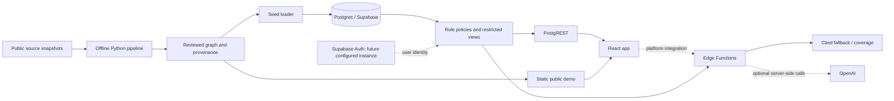

# PathNet: AI Atlas for the World's Rare Diseases

Hack-Nation × OpenAI × Buffalo Initiative, Challenge 05. A mechanism-first knowledge graph that helps a patient-group leader find a cited connection, an existing research resource, a potential partner and a concrete question to take to an expert. A coverage gap is shown as a gap in this selected dataset.

**Local prototype, 2026-10-04.** P1 has delivered the real STXBP1 slice with SCN2A, KCNQ2 and SCN8A neighbours. P4 supplies the platform against that release. No Supabase project or deployment platform is configured. Native PostgreSQL accounts support onboarding, saved preferences and operator-assigned protected roles; the public role selector remains a presentation preference. Cloud authentication, deployed acceptance and videos remain outstanding. See [P4 task status](context/P4-TASK-STATUS.md) for the earlier platform verification boundary and [Accounts and onboarding](docs/frontend/accounts.md) for the local account adapter.

Publication scope: branch `p1/data` bundles the 58-node M1 source/data snapshot, English integration documentation and the platform dependencies needed to reproduce the accepted local database/app workflow. The user has authorized committing and pushing this existing branch. The historical local acceptance and separate publication checks are distinguished in [P1 publication scope](context/P1-PUBLICATION.md); no cloud deployment or submission is claimed.

## Start the complete local stack

From the repository root, with Docker Desktop running and Bash available:

```bash
bash run.sh up
```

This foreground command runs the database, deterministic cache builder, migration/seed/cache import, REST API and web app. Host Python, Node.js and AI/cloud keys are unnecessary for this local startup. First startup downloads container images and locked frontend dependencies. Keep this terminal open for logs; once ready, run `bash run.sh smoke` in a second terminal to check the graph, family explanations, current coverage, web response and account service configuration.

The one-shot `cache-build` service uses Node.js 24 Alpine to create 20 role-scoped explanations and one coverage snapshot in the dedicated `bootstrap_cache` Docker volume. The seed service waits for a healthy database and successful cache build, then runs all migrations, graph upsert and cache import, including account storage. API/web startup depends on successful seeding. The frontend runs `npm ci`, a production build and then the Next.js development server with the account service connected to the database. This local server is not a production deployment.

`bash run.sh seed` also rebuilds/imports the current caches automatically. Re-running seed retains platform records and approved graph contributions. `bash run.sh down` stops the stack and retains its volumes. `bash run.sh reset` deletes those local volumes and recreates the stack; use it only to deliberately discard that database.

| Service | Local address | Purpose |
| --- | --- | --- |
| Web | http://localhost:5173 | Next.js app and account API |
| REST API | http://localhost:3001 | PostgREST over the five graph tables |
| Database | localhost:54322 | Local PostgreSQL, database `pathnet` |

PostgreSQL uses a persistent `pgdata` Docker volume; db/api/web use `restart: unless-stopped` while Docker is available. This does not configure Windows or Docker boot startup. The earlier shared-stack acceptance remains in [P1-INTEGRATION.md](context/P1-INTEGRATION.md). The graph bootstrap was tested from a clean staged Git archive with initially empty volumes before the account startup changes; [P4-BOOTSTRAP.md](context/P4-BOOTSTRAP.md) and [its receipt](data/acceptance/m1-bootstrap.json) record that earlier fresh startup, automatic cache refresh and warm restart/preservation verification.

For an isolated parallel stack, export these optional values in the terminal used for startup and smoke:

```bash
export COMPOSE_PROJECT_NAME=pathnet-p4
export PATHNET_DB_PORT=54323
export PATHNET_API_PORT=3002
export PATHNET_WEB_PORT=5174
bash run.sh up
```

Defaults are `pathnet`, 54322, 3001 and 5173 respectively. Different project names isolate Docker volumes; different ports avoid conflicts. The browser API URL and smoke checks follow the selected ports.

To run the frontend directly on your computer after cloning, install Node.js and keep Docker Desktop running, then run:

```bash
npm --prefix web ci
npm --prefix web run dev
```

When no account database connection is configured, the development command starts the repository's Docker database, cache/seed services and REST API, initializes account storage, and creates the ignored `web/.env.local` if it does not exist. It uses the ports and project settings resolved by Docker Compose from the root `.env` and your terminal environment. Registration and saved preferences work on first startup; no host Python or cloud keys are required. Subsequent starts preserve the database and accounts. Without Docker, configure an existing PostgreSQL database as described in [Accounts and onboarding](docs/frontend/accounts.md).

The generated configuration includes `PATHNET_ACCOUNT_LOCAL=true`, so later development starts also restart the managed database after it has been stopped. When replacing that generated connection with an independently managed database, set `PATHNET_ACCOUNT_LOCAL=false`. An account URL supplied directly in your terminal always takes precedence over the generated configuration.

Automatic local startup also uses the Compose web port (`PATHNET_WEB_PORT`, default 5173) for the frontend running on your computer; `PORT` takes precedence if set. With an independently managed database, use `PORT` to select that frontend port. To smoke-check the managed stack while its frontend runs outside Docker, set its actual origin explicitly, for example `WEB_URL=http://localhost:5173 bash run.sh smoke`.

Set `PATHNET_ACCOUNT_BOOTSTRAP=false` to skip automatic database preparation for a guest-only or independently managed workflow. A guest-only app should also leave the account database URL unset and disable the account proxy. `npm run build` never provisions or starts a database.

## Architecture and shared interfaces



Source retrieval, extraction, reconciliation and clustering run offline. The live app reads the stored graph. Optional model calls belong in server-side functions; API keys never belong in browser variables. The Blueprint's Supabase/Auth deployment is the target; local Postgres and static data support development before a cloud project exists.

- [contract/contract.json](contract/contract.json) is the shared enum authority. The graph stays `{nodes, edges, evidence, clusters, node_cluster}`; node IDs remain stable text slugs and labels remain `name`.
- [web/src/api.ts](web/src/api.ts) keeps `loadGraph(): Promise<Graph>`. Coverage, provenance and demo paths are sidecars, not extra graph tables.
- [Platform API contract](contract/platform-api.md) specifies path explanation, abstract extraction and coverage responses for P2/P3 integration. [P4 platform notes](context/P4-PLATFORM.md) cover roles, contributions and local verification.
- NIH funding remains in award assets' `props.funder` and the existing `asset_disease` relationship. A shared funder does not establish a biological mechanism; this release adds no funder node or edge type.

The five roles are `family`, `group_leader`, `scout`, `researcher` and `admin`. Backend policies enforce the role assigned to an authenticated user. A client-selected role is never authorization. Public graph discovery and restricted professional-contact access are separate; the P1 release contains no personal email or phone fields.

## Dataset and evidence

The **P1 M1 snapshot, updated on 2026-10-04 (Europe/Berlin),** contains **58 nodes, 69 edges, 77 evidence rows, 4 provisional mechanism clusters and 70 memberships**. Every edge has evidence: 49 tier A database associations and 20 tier B source-backed claims. There are no tier C inferred bridges or tier D contributions in this baseline. `verified` means checked against the cited source within the claim's scope. All confidence values are `null`; calibrated probabilities were not measured.

The **2026-10-04 M1 update** includes **451 raw files**, comprising 449 data/cache/receipt files, `.gitkeep` and the `curate_community.py` helper, totalling **50,866,487 bytes**. Retrieval timestamps are UTC; late October 3 provider requests occurred on October 4 in Europe/Berlin. Eight public group/resource pages were verified through live Bright Data requests. Five ClinVar identities cover all four genes; the three new identity-only examples retain unknown functional effect. The new STXBP1 RARE-X asset describes patient-owned data collection with qualified access, rather than treatment efficacy. The cached corpus contains 159 nonempty PubMed abstracts, 32 unique studies and 82 annual NIH award records. Searches and graph selections are deliberately bounded.

SCN2A illustrates why variants in one gene can belong to different functional groups. Assay context and evidence limiting a simple gain/loss classification remain visible. The primary journey links the STXBP1 Foundation, the STXBP1 condition and STARR natural-history resource. Its asset and official study record describe the same resource. See [stable demo IDs and scopes](data/seed/demo_paths.json), [provenance](data/seed/provenance.json), [source-context review](context/P1-EVIDENCE-REVIEW.md) and [source inventory, licences and limitations](context/SOURCES.md).

This service uses the **Human Phenotype Ontology project, version 2026-09-01**, with **HPO annotation release 2026-09-02**. We acknowledge the Human Phenotype Ontology Consortium and retain its [licence conditions](https://human-phenotype-ontology.github.io/license.html). Mondo is credited to the Monarch Initiative under CC BY 4.0; Orphadata to Orphanet / INSERM under CC BY 4.0; HGNC provides CC0 nomenclature data. NCBI/NLM resources are used under their [disclaimer and copyright policies](https://www.ncbi.nlm.nih.gov/home/about/policies/); some abstracts retain author or publisher copyright. Full abstracts and original public page bodies are bundled for source audit; the graph retains short attributable excerpts. Bundling does not change each source's copyright, licence or terms, and no blanket open licence is assigned to these materials. OMIM was not queried directly.

## Reproduce the reviewed baseline

Use Python 3.10 or later from the repository root:

```bash
python -m venv .venv
# macOS / Linux
source .venv/bin/activate
python -m pip install -r pipeline/requirements.txt
```

On Windows PowerShell, use `.\.venv\Scripts\Activate.ps1` instead of `source`.

Rebuild from the bundled local compact curation snapshots and validate the graph:

```bash
python pipeline/build_graph.py
python pipeline/validate_graph.py
python -m unittest discover -s pipeline/tests -p 'test_*.py'
```

`make data` runs the builder and raw-source validation; `make verify` runs raw validation, pinned PubMed verification and pipeline tests. Set `PYTHON=/path/to/python` if Make should use another interpreter. PowerShell users without Make can use the Python commands directly.

These commands require no network, API keys, model calls or running database after dependencies are installed. Expected counts are 58 nodes, 69 edges, 77 evidence rows, 4 clusters and 70 memberships. The builder replaces the P1 baseline; preserve later P2 merges or use `python pipeline/build_graph.py --output-dir /path/to/comparison` to rebuild separately.

The bundled original source snapshot enables stronger offline checks:

```bash
python pipeline/validate_graph.py --check-raw
python pipeline/fetch_groups.py --validate-curation
python pipeline/restore_pubmed.py --check
```

These verify original raw-file hashes, quoted content and the pinned abstract corpus. The `p1/data` publication snapshot includes these reviewed caches and all four seed sidecars. See [publication scope and checks](context/P1-PUBLICATION.md) for the branch boundary. Re-fetching a changing source creates a new snapshot and may require renewed curation; it is not guaranteed to reproduce the original response hashes. [P1's integration guide](context/P1-DATA.md) describes selective retrieval and pinned replay. New Bright Data requests require `BRIGHTDATA_API_KEY` and `BRIGHTDATA_UNLOCKER_ZONE`; the eight reviewed page snapshots replay offline without credentials. [Provider receipts](data/raw/groups/brightdata_acquisition.json) record target statuses, source hashes and evidence IDs. Source access restrictions and local-only NORD responses remain documented in [SOURCES.md](context/SOURCES.md).

## Optional direct operator setup and verification

The normal Docker bootstrap performs these migrations and cache steps automatically. The following commands are for a separate, deliberately configured database and require host Python/Node.js.

Copy `.env.example` to a local `.env` and keep secrets out of version control. Inspect configuration without contacting services:

```bash
python scripts/platform.py doctor
```

When a local or future cloud PostgreSQL database is deliberately configured in `DATABASE_URL`, apply migrations and load the reviewed graph:

```bash
python scripts/platform.py migrate
python scripts/platform.py seed

# Rebuild/import deterministic explanation caches after graph changes (Node.js 24):
node scripts/build_platform_cache.mjs
python scripts/platform.py cache --input .venv/p4-platform-cache.json
```

These direct operator commands require host Python/Node.js and a deliberately configured `DATABASE_URL`; they are optional alternatives to the complete Docker bootstrap. `bash run.sh up` and `bash run.sh seed` build/import the deterministic bundle inside containers automatically. The earlier M1 seed/smoke run is recorded in [the historical integration receipt](data/acceptance/m1-docker-integration.json). Fresh one-command bootstrap acceptance is tracked in [P4-BOOTSTRAP.md](context/P4-BOOTSTRAP.md). Graph upsert retains other rows such as approved contributions. The unchanged P1 command `python pipeline/load_seed.py` replaces the graph tables; use it only for deliberate baseline replacement, since that removes approved contribution edges even though platform audit records remain.

Role-policy, endpoint and CLI tests run locally without Supabase credentials; see [exact prerequisites and commands](context/P4-PLATFORM.md#local-verification). Once Supabase Auth exists, `python scripts/platform.py demo-users` provisions the five configured demo identities, and `python scripts/platform.py smoke-auth` checks their real API sessions. Neither command has been run against a configured project in this delivery, and they do not constitute browser/UI acceptance.

## OpenAI usage and current limits

P2 owns model extraction, reconciliation, scoring, final clustering, prompts and gold-set evaluation. P4 provides server-side explanation/extraction boundaries and evidence checks. The P1 seed is source-curated; its delivery does not establish that a live OpenAI call, evaluation result or extraction precision target has been achieved. No key is required for baseline replay or the deterministic local platform path. Configure model credentials only when validating the optional server-side model path.

The four supplied clusters are reviewed P1 starting groups. The current UI still needs P3's action view, authenticated persona homes, contribution/admin screens and platform API integration. Five local authorization identities in tests do not constitute five working browser logins. Supabase Auth, cloud database execution, production deployment, a clean-browser role walkthrough, read-aloud, walkthrough/team videos and submission remain gates before claiming the full Blueprint MVP.

Recruitment statuses are dated observations: the selected CAP-002 and NBI-921352 studies were terminated, and the KCNQ2 phenotype study had unknown status. A registry or grant link does not establish treatment efficacy, eligibility or permission to reuse participant data. The no-route fixture is an unknown query in this slice, not a claim that a named disease has no research. No measured 10× impact is claimed.

## Repository guide

| Path | Responsibility |
| --- | --- |
| `pipeline/`, `data/` | Source retrieval, reviewed seed, evidence and offline processing |
| `supabase/` | Schema, role policies and server-side functions |
| `contract/` | Shared graph enums and platform API contract |
| `web/` | React application and platform integration boundary |
| `scripts/`, `run.sh` | Local setup and verification |
| `context/` | Role briefs, handoffs and acceptance evidence |

The [one-minute demo script](context/P4-DEMO-SCRIPT.md) is a recording plan grounded in the delivered fixture. It is not a claim that the planned screens or a video already exist.

## Local accounts and onboarding

The frontend supports native local accounts and saved profile preferences without changing graph contracts. Both `bash run.sh up` and the fresh-clone development commands above configure the account database and initialize its storage automatically. Existing database installations can supply the server-only `PATHNET_ACCOUNT_DATABASE_URL` using `web/.env.example`; development startup then checks account storage without replacing saved users. `npm run accounts:setup` remains available for an explicit setup check. This adapter supplements the existing Supabase integration; it does not replace Supabase Auth. See [Accounts and onboarding](docs/frontend/accounts.md) for role assignment, guest access, simple language, and the boundary between database-backed preferences and browser-only action progress.
